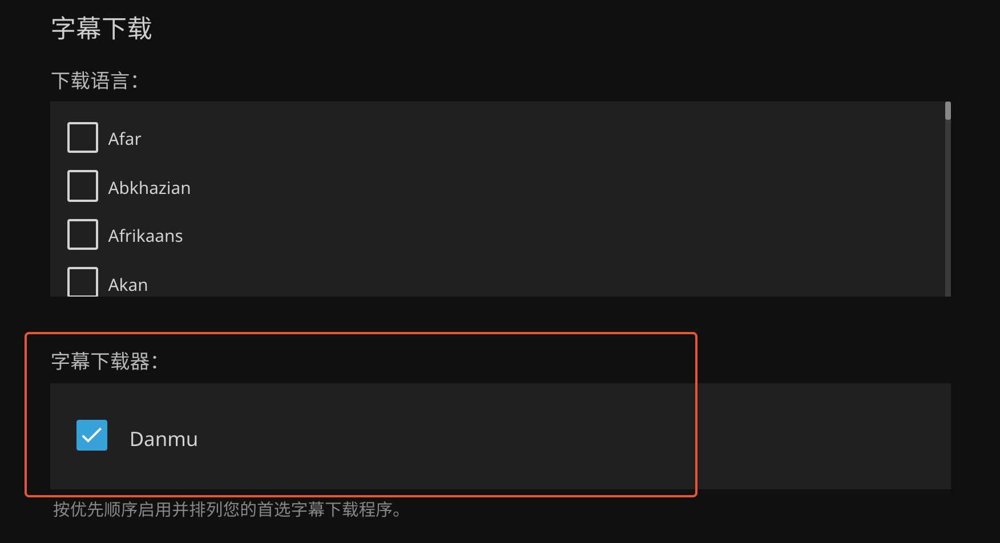

# jellyfin-plugin-danmu

[](https://github.com/cxfksword/jellyfin-plugin-danmu/releases)
[](https://github.com/cxfksword/jellyfin-plugin-danmu/releases)
[](https://github.com/cxfksword/jellyfin-plugin-danmu/main/LICENSE) 

jellyfin弹幕自动下载插件，已支持的弹幕来源：b站，弹弹play，优酷，爱奇艺，腾讯视频，芒果TV。

支持功能：

* 自动下载xml格式弹幕
* 生成ass格式弹幕
* 可配置定时更新
* 支持api访问弹幕


## 安装插件

只支持最新的`jellyfin 10.8.x`版本

添加插件存储库：

国内加速：https://mirror.ghproxy.com/https://github.com/cxfksword/jellyfin-plugin-danmu/releases/download/manifest/manifest_cn.json

国外访问：https://github.com/cxfksword/jellyfin-plugin-danmu/releases/download/manifest/manifest.json

> 如果都无法访问，可以直接从 [Release](https://github.com/cxfksword/jellyfin-plugin-metashark/releases) 页面下载，并解压到 jellyfin 插件目录中使用

## 如何使用

1. 安装后，进入`控制台 -> 插件`，查看下`Danmu`插件是否是**Active**状态
2. 进入`控制台 -> 媒体库`，点击任一媒体库进入配置页，在最下面的`字幕下载`选项中勾选**Danmu**，并保存

   

3. 新加入的影片会自动获取弹幕（只匹配番剧和电影视频），旧影片可以通过计划任务**扫描媒体库匹配弹幕**手动执行获取
4. 假如弹幕匹配错误，请在电影或剧集中使用**修改字幕**功能搜索修正
5. 对于电视剧或动画，需要保证每季视频集数一致，并正确填写集号，这样每季视频的弹幕才会自动获取
6. 同时生成ass弹幕，需要在插件配置中打开，默认是关闭的
7. 定时更新需要自己到计划任务中添加定时时间，默认手工执行更新
  
> B站电影或季元数据也支持手动指定BV/AV号，来匹配UP主上传的视频弹幕。多P视频和剧集是按顺序一一对应匹配的，所以保证jellyfin中剧集有正确的集号很重要

## 支持的api接口

* `/plugin/danmu/{id}`:  获取影片或剧集的xml弹幕链接，不存在时，url为空
* `/plugin/danmu/raw/{id}`:  获取影片或剧集的xml弹幕文件内容


## 如何播放

xml格式：

* [弹弹play](https://www.dandanplay.com/) (Windows/Mac/Android)
* [KikoPlay](https://github.com/KikoPlayProject/KikoPlay) (Windows/Mac)
* [Fileball](https://fileball.app/) (iOS/iPadOS/AppleTV)


ass格式：

* PotPlayer (Windows)
* IINA (Mac)
* Infuse (Mac/iOS/iPadOS/AppleTV)


## How to build

1. Clone or download this repository

2. Ensure you have .NET Core SDK setup and installed

3. Build plugin with following command.

```sh
dotnet restore 
dotnet publish Jellyfin.Plugin.Danmu/Jellyfin.Plugin.Danmu.csproj
```


## How to test

1. Build the plugin

2. Create a folder, like `danmu` and copy  `./Jellyfin.Plugin.Danmu/bin/Debug/net6.0/Jellyfin.Plugin.Danmu.dll` into it

3. Move folder `danmu` to jellyfin `data/plugins` folder

## Thanks

[downkyi](https://github.com/leiurayer/downkyi)

