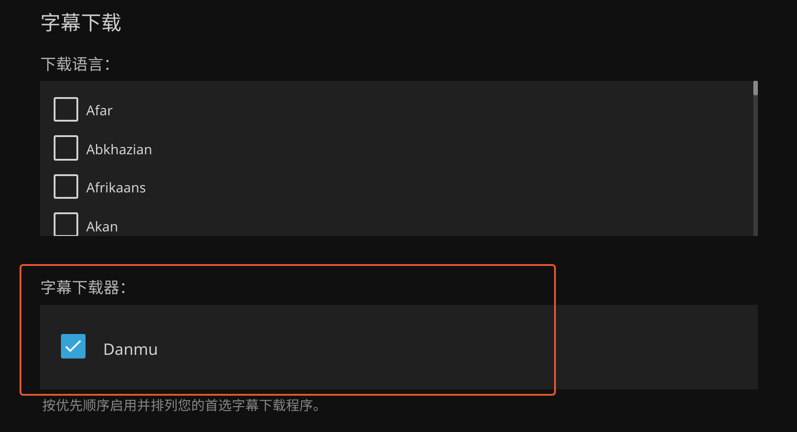

# jellyfin-plugin-danmu

[](https://github.com/cxfksword/jellyfin-plugin-danmu/releases)
[](https://github.com/cxfksword/jellyfin-plugin-danmu/releases)
[](https://github.com/cxfksword/jellyfin-plugin-danmu/main/LICENSE) 

jellyfin弹幕自动下载插件，已支持的弹幕来源：b站，~~弹弹play~~，优酷，爱奇艺，腾讯视频，芒果TV。

支持功能：

* 自动下载xml格式弹幕
* 生成ass格式弹幕
* 支持api访问弹幕
* 兼容弹弹play接口规范访问


## 安装插件

添加插件存储库：

国内加速：https://ghfast.top/https://github.com/cxfksword/jellyfin-plugin-danmu/releases/download/manifest/manifest_cn.json

国外访问：https://github.com/cxfksword/jellyfin-plugin-danmu/releases/download/manifest/manifest.json

> 如果都无法访问，可以直接从 [Release](https://github.com/cxfksword/jellyfin-plugin-danmu/releases) 页面下载，并解压到 jellyfin 插件目录中使用

> emby 请使用 fengymi 维护的：https://github.com/fengymi/emby-plugin-danmu

## 如何使用

1. 安装后，进入`控制台 -> 插件`，查看下`Danmu`插件是否是**Active**状态
2. 进入`控制台 -> 媒体库`，点击任一媒体库进入配置页，在最下面的`字幕下载`选项中勾选**Danmu**，并保存

   

3. 新加入的影片会自动获取弹幕（只匹配番剧和电影视频），旧影片可以通过计划任务**扫描媒体库匹配弹幕**手动执行获取
4. 假如弹幕匹配错误，请在电影或剧集中使用**修改字幕**功能搜索修正
5. 对于电视剧或动画，需要保证每季视频集数一致，并正确填写集号，这样每季视频的弹幕才会自动获取
6. 同时生成ass弹幕，需要在插件配置中打开，默认是关闭的
  
> B站电影或季元数据也支持手动指定BV/AV号，来匹配UP主上传的视频弹幕。多P视频和剧集是按顺序一一对应匹配的，所以保证jellyfin中剧集有正确的集号很重要

## 支持的api接口

* `/api/danmu/{id}`:  获取jellyfin电影或剧集的xml弹幕链接，不存在时，url为空
* `/api/danmu/{id}/raw`:  获取jellyfin电影或剧集的xml弹幕文件内容
* `/api/danmu/refresh?id={itemId}` 或 `/api/danmu/{itemId}/refresh`:  重新获取对应电影/剧集/季的弹幕。传入**剧集（Episode）**的 id 时，仅刷新该单集弹幕（需该集已匹配过弹幕来源，未匹配则忽略）。接口返回 json 结果 `{"id":...,"type":...,"success":true,"message":...}`，可用于脚本批量补全缺失弹幕
* `/api/v2/search/anime?keyword=xxx`: 根据关键字搜索影视
* `/api/v2/search/episodes?anime=xxx`: 根据关键字搜索影视的剧集信息
* `/api/v2/bangumi/{bangumiId}`: 获取影视详细信息
* `/api/v2/comment/{episodeId}?format=xml`: 获取弹幕内容，默认json格式

## 如何播放

xml格式：

* [switchfin](https://github.com/dragonflylee/switchfin) (Windows/Mac/Linux) 🌟
* [Senplayer](https://apps.apple.com/us/app/senplayer-video-media-player/id6443975850) (iOS/iPadOS/AppleTV) 🌟
* [弹弹play](https://www.dandanplay.com/) (Windows/Mac/Android)
* [KikoPlay](https://github.com/KikoPlayProject/KikoPlay) (Windows/Mac)


ass格式：

* PotPlayer (Windows)
* IINA (Mac)
* Infuse (Mac/iOS/iPadOS/AppleTV)


## How to build

1. Clone or download this repository

2. Ensure you have .NET Core SDK 9.0 setup and installed

3. Build plugin with following command.

```sh
dotnet restore 
dotnet publish --configuration=Release Jellyfin.Plugin.Danmu/Jellyfin.Plugin.Danmu.csproj
```


## How to test

1. Build the plugin

2. Create a folder, like `danmu` and copy  `./Jellyfin.Plugin.Danmu/bin/Release/net9.0/Jellyfin.Plugin.Danmu.dll` into it

3. Move folder `danmu` to jellyfin `data/plugins` folder

## Thanks

[downkyi](https://github.com/leiurayer/downkyi)


## 免责声明

本项目代码仅用于学习交流编程技术，下载后请勿用于商业用途。

如果本项目存在侵犯您的合法权益的情况，请及时与开发者联系，开发者将会及时删除有关内容。
